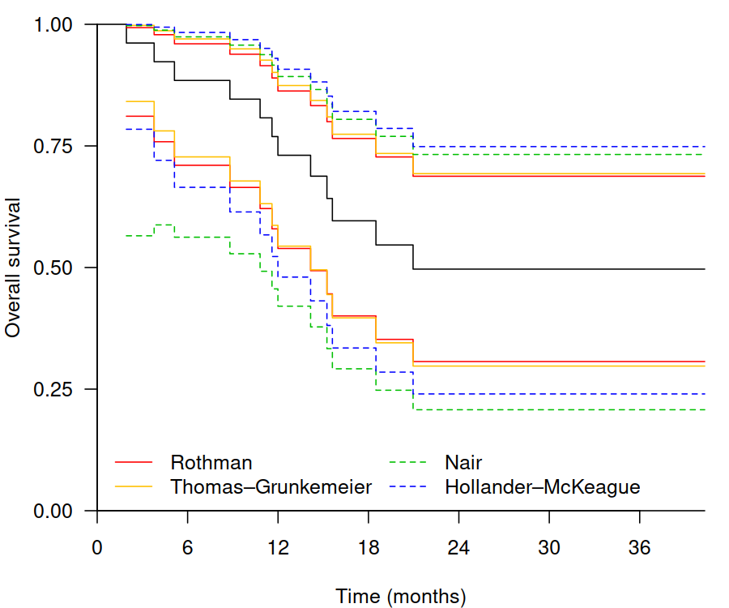

<!-- README.md is generated from README.Rmd. Please edit that file -->

# WHKMconf

<!-- badges: start -->
<!-- badges: end -->

This package re-implements selected pointwise confidence intervals and
simultaneous confidence bands for Kaplan-Meier survival estimates from
the the `km.ci` package, and from the work of Sachs, Brand, and Gabriel
([DOI:10.1038/s41416-022-01920-5](https://www.nature.com/articles/s41416-022-01920-5)).
The implementation for Nair confidence bands allows arbitrary confidence
levels rather than being restricted to pre-computed tables of $e_\alpha$
critical values. The implementation for Thomas–Grunkemeier confidence
intervals maintains numerical stability at extremely small $\alpha$
values that may arise during the construction of Hollander–McKeague
confidence bands. ‘WH’ code is designed to maximise speed, for use in
simulation studies. As such, input validation is minimal and the user is
responsible for ensuring valid use.

## Installation

You can install the development version of WHKMconf from
[GitHub](https://github.com/hongconsulting/WHKMconf) with:

``` r
remotes::install_github("hongconsulting/WHKMconf")
```

## Example

``` r
library(survival)
library(WHKMconf)
data <- data.frame("time" = survival::ovarian$futime, "status" = survival::ovarian$fustat)
fit <- survival::survfit(survival::Surv(time * 12 / 365.2425, status) ~ 1, data = data)
s <- summary(fit)

CI <- data.frame("time" = s$time, "surv" = s$surv)
CI.R <- data.frame(WH_Rothman(s$surv, s$n.risk, s$n.event))
CI <- cbind(CI, setNames(CI.R, c("Rl", "Ru")))
CI.TG <- data.frame(WH_ThomasGrunkemeier(s$time, s$n.risk, s$n.event))
CI <- cbind(CI, setNames(CI.TG, c("TGl", "TGu")))
CI.N <- data.frame(WH_Nair(s$time, s$surv, s$std.err, s$n.risk, s$n.event))
CI <- cbind(CI, setNames(CI.N, c("Nl", "Nu")))
CI.HM <- data.frame(WH_HollanderMcKeague(s$time, s$n.risk, s$n.event))
CI <- cbind(CI, setNames(CI.HM, c("HMl", "HMu")))

t_max <- max(data$time * 12/365.2425)
t_eventmax <- max(data$time[data$status==1] * 12/365.2425)
if (max(CI$time) < t_max) {
  CI <- rbind(CI, tail(CI, 1))
  CI$time[nrow(CI)] <- t_max
}

par(cex = 1, las = 1, mar = c(4, 4, 4, 1))
plot(x = CI$time, y = CI$surv, type = "s", xaxs = "i", yaxs = "i", xaxt = "n", yaxt = "n", xlab = "Time (months)", ylab = "Overall survival", xlim = c(0, t_max), ylim = c(0, 1))
axis(1, at = seq(0, t_max, 6))
axis(2, at = seq(0, 1, 0.25))
lines(y = CI$Rl, x = CI$time, type = "s", lty = 1, col = grDevices::rgb(1, 0, 0))
lines(y = CI$Ru, x = CI$time, type = "s", lty = 1, col = grDevices::rgb(1, 0, 0))
lines(y = CI$TGl, x = CI$time, type = "s", lty = 1, col = grDevices::rgb(1, 0.75, 0))
lines(y = CI$TGu, x = CI$time, type = "s", lty = 1, col = grDevices::rgb(1, 0.75, 0))
clip(x1 = 0, y1 = 0, x2 = t_eventmax, y2 = 1)
lines(y = CI$Nl, x = CI$time, type = "s", lty = 2, col = grDevices::rgb(0, 0.75, 0))
lines(y = CI$Nu, x = CI$time, type = "s", lty = 2, col = grDevices::rgb(0, 0.75, 0))
clip(x1 = 0, y1 = 0, x2 = t_max, y2 = 1)
lines(y = CI$HMl, x = CI$time, type = "s", lty = 2, col = grDevices::rgb(0, 0, 1))
lines(y = CI$HMu, x = CI$time, type = "s", lty = 2, col = grDevices::rgb(0, 0, 1))
legend(legend = c("Rothman", "Thomas\u2013Grunkemeier", "Nair", "Hollander\u2013McKeague"),
       col = c(grDevices::rgb(1, 0, 0), grDevices::rgb(1, 0.75, 0),
               grDevices::rgb(0, 0.75, 0), grDevices::rgb(0, 0, 1)),
       bty = "n", lty = c(1, 1, 1, 2), inset = 0, ncol = 2,
       x = 0, y = 0, yjust = 0, xpd = TRUE)
```

<!-- -->

## Further Reading

1.  Borokov, A.A. and Sycheva, N.M., 1968. On asymptotically optimal
    non-parametric criteria. *Theory of Probability & Its Applications*,
    13(3), pp. 359–393.
2.  Hall, W.J. and Wellner, J.A., 1980. Confidence bands for a survival
    curve from censored data. *Biometrika*, 67(1), pp. 133–143.
3.  Hollander, M. and McKeague, I.W., 1997. Likelihood ratio-based
    confidence bands for survival functions. *Journal of the American
    Statistical Association*, 92(437), pp. 215–226.
4.  Klein, J.P. and Moeschberger, M.L., 2003. Appendix C: Statistical
    Tables. In *Survival Analysis: Techniques for Censored and Truncated
    Data*, pp. 455–482. New York: Springer New York.
5.  Nair, V.N., 1984. Confidence bands for survival functions with
    censored data: a comparative study. *Technometrics*, 26,
    pp. 265–275.
6.  Rothman, K.J., 1978. Estimation of confidence limits for the
    cumulative probability of survival in life table analysis. *Journal
    of Chronic Diseases*, 31(8), pp. 557–560.
7.  Sachs, M.C., Brand, A. and Gabriel, E.E., 2022. Confidence bands in
    survival analysis. *British Journal of Cancer*, 127(9),
    pp. 1636–1641.
8.  Thomas, D.R. and Grunkemeier, G.L., 1975. Confidence interval
    estimation of survival probabilities for censored data. *Journal of
    the American Statistical Association*, 70(352), pp. 865–871.
